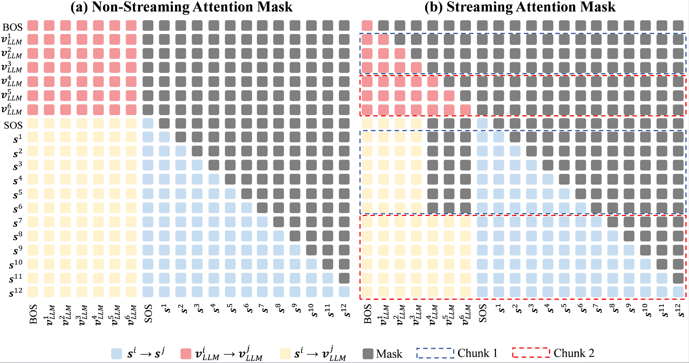
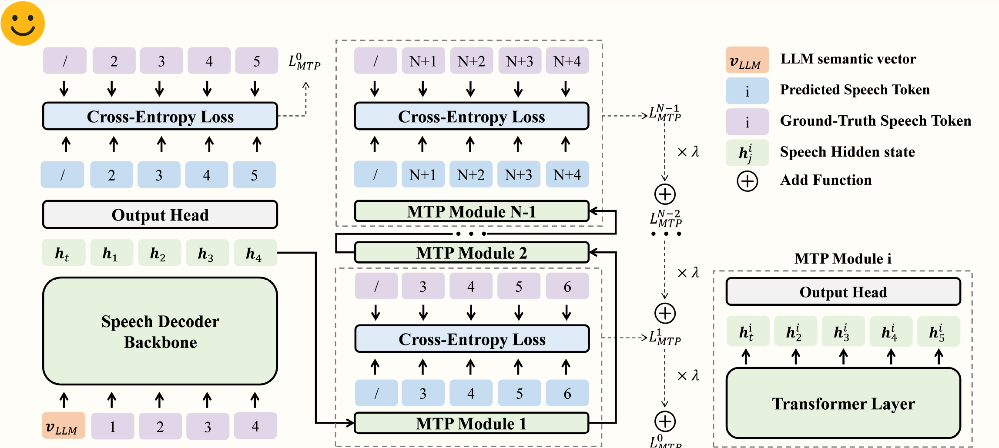

<div align="center">


# **🎧VocalNet: Speech LLM with Multi-Token Prediction for Faster and High-Quality Generation**
<!-- # 🎧VocalNet: Speech LLM with Multi-Token Prediction for Faster and High-Quality Generation -->
<!-- <strong>English | 
[Chinese](./README_zh.md)</strong> -->

</div>

<p align="center">
HuggingFace <a href="https://huggingface.co/VocalNet">🤗</a> | ModelScope <a href="https://www.modelscope.cn/organization/VocalNet">🔮</a>  | Paper <a href="https://arxiv.org/abs/2504.04060">📖</a> | Demo <a href="https://mumuyeye.github.io/VocalNet/">🎥</a> | WeChat <a href="https://github.com/SJTU-OmniAgent/VocalNet/blob/main/images/Wechatgroup_0507.jpg">💬</a> 
</p>
<p align="center">
Shanghai Jiao Tong University</a>  |  Ant Group</a> 
</p>

<div align="center"></div>

## 🔥 News
- **[21/08]** 🎉 **VocalNet is accepted at EMNLP 2025 main conference!**
- **[25/05]** 🎉 We have released the training code and pretrained model weights for **VocalNet-qwen25-7B**, based on Qwen2.5. Additionally, we've updated the streaming inference code.
- **[25/04]** 🎉 **VocalNet is here!** Check out our released code, model, and datasets.  


## 👀 VocalNet Overview

**VocalNet** is a series of high performance, low-latency speech LLMs enabled by a scalable and model-agnostic training framework for real-time voice interaction. VocalNet introduces **multi-token prediction (MTP)**, a novel approach optimized for speech LLMs that simultaneously improves generation speed and quality. VocalNet outperforms many mainstream Omni LLMs and existing open-source speech LLMs despite using significantly less training data. 

- **VocalNet-1B**: Built upon [LLaMA-3.2-1B-Instruct](https://huggingface.co/meta-llama/Llama-3.2-1B-Instruct). With much fewer model parameters, VocalNet-1B achieves performance comparable to mainstream speech LLMs, including LLaMA-Omni, Freeze-Omni, and GLM-4-Voice.

- **VocalNet-8B**: Built upon [LLaMA-3.1-8B-Instruct](https://huggingface.co/meta-llama/Llama-3.1-8B-Instruct). In the evaluation of speech interaction models, VocalNet-8B significantly outperforms most mainstream speech LLMs and Omni LLMs.

- **VocalNet-Qwen25-7B (VocalNet-ML)**: Built upon [Qwen2.5-7B-Instruct](https://huggingface.co/Qwen/Qwen2.5-7B-Instruct). The model enables natural voice interactions in both English and Chinese, with seamless multilingual capabilities.

<details>

<summary>Model Architecture & Training Strategy</summary>

<div align="center"></div>

- VocalNet consists of a speech encoder to convert waves into speech representations, a pre-trained LLM backbone and a speech decoder for speech token generation. A downsample adaptor is added after the speech encoder to achieve a lower frame rate, and a speech projector to bridge the dimension gap between the LLM hidden state and decoder inputs. The generated speech token is sent to the speech vocoder, in which the corresponding speech response is constructed.

- VocalNet adopts a dual-stage training strategy: Multi-Modal Alignment and Generative Supervised Fine-Tuning. In the first stage, VocalNet is trained using speech queries and text responses. The LLM backbone is trained using LoRA along with the downsample adaptor. In the second stage, VocalNet is trained using speech queries and speech responses. The major components are frozen, while the speech projector and speech decoder are trained.

</details>

<details>
<summary> Streaming Decoding </summary>

<div align="center"></div>

VocalNet employs two attention mask mechanisms tailored for complete sequence processing and real-time speech generation respectively, inspired by [MiniCPM-o](https://openbmb.notion.site/MiniCPM-o-2-6-A-GPT-4o-Level-MLLM-for-Vision-Speech-and-Multimodal-Live-Streaming-on-Your-Phone-185ede1b7a558042b5d5e45e6b237da9). For non-streaming mode, the text position attends to whole text positions, and the speech position attends to the whole text positions, itself and its previous speech positions. For streaming mode, the text position attends to itself and its previous text positions, and the speech position attends to chunk-limited text positions, itself and its previous speech positions.

</details>


<details>
<summary> MTP Implementation </summary>

<div align="center"></div>
VocalNet utilizes N-1 sequential Transformer layers as MTP modules, enabling the prediction of N speech tokens in a single inference step while preserving the temporal relationships. In addition, a layer-wise decaying cross-entropy loss is introduced as the MTP loss.


</details>

## 🙌 Quick Start

### Repo Download and Environment Preparartion

```bash
git clone https://github.com/YHWmz/VocalNet.git
cd VocalNet

conda create -n vocalnet python==3.10
conda activate vocalnet
pip install --upgrade pip
conda install pytorch==2.1.2 torchvision==0.16.2 torchaudio==2.1.2 pytorch-cuda=12.1 -c pytorch -c nvidia
pip install -e .

# Optional: Install additional packages for training
pip install -e ".[train]"
pip install flash-attn --no-build-isolation
```

### Data Preparartion

1. We provide two re-synthesized datasets for VocalNet training:

- VoicaAssistant-430K from Mini-Omni: &nbsp;&nbsp;[ModelScope](https://modelscope.cn/datasets/VocalNet/VoiceAssistant-430K-vocalnet) &nbsp;&nbsp;&nbsp; [HuggingFace](https://huggingface.co/datasets/VocalNet/VoiceAssistant-430K-vocalnet)
- UltraChat from SLAM-Omni: &nbsp;&nbsp;[ModelScope](https://modelscope.cn/datasets/VocalNet/UltraChat-vocalnet) &nbsp;&nbsp;&nbsp; [HuggingFace](https://huggingface.co/datasets/VocalNet/UltraChat-vocalnet)

Here's an example of a training data instance in JSON format:


```json
[
  {
        "id": "19090",
        "speech": "VoiceAssistant-430K-vocalnet/audios/19090.wav",
        "conversations": [
            {
                "from": "human",
                "value": "<speech>"
            },
            {
                "from": "gpt",
                "value": "The legality of shooting someone who breaks into your house depends on the laws of your specific location. In some places, \"stand your ground\" laws or \"castle doctrine\" laws allow homeowners to use lethal force if they feel threatened. However, other areas may require you to retreat if possible before using force. It's important to familiarize yourself with the laws in your region and consider non-lethal methods of protection as well. Consulting with a legal expert can provide you with guidance tailored to your situation."
            }
        ],
        "units": "VoiceAssistant-430K-vocalnet/cosyvoice2_tokens/19090.npy"
    }
]

```

After downloading them, organize the data as follows in `./playground/`,

```
├── VoiceAssistant-430K-vocalnet
│   ├── audios
│   └── cosyvoice2_tokens
└── UltraChat-vocalnet
    ├── audios
    └── cosyvoice2_tokens
```

The speech wave is synthesized with [CosyVoice2](https://github.com/FunAudioLLM/CosyVoice), and we use CosyVoice 2’s speech tokenizer to extract the speech tokens.


### Model Training

#### Stage I: Multi-Modal Alignment S2T

1. Download Base LLM and speech encoder
- Base LLM: [LLaMA-3.2-1B-Instruct](https://huggingface.co/meta-llama/Llama-3.2-1B-Instruct)  &nbsp;&nbsp;&nbsp; [LLaMA-3.1-8B-Instruct](https://huggingface.co/meta-llama/Llama-3.1-8B-Instruct)
- Speech encoder: [Whisper-large-v3](https://huggingface.co/openai/whisper-large-v3)


2. Path Modification in `scripts/mtp/llama_stage1_s2t.sh`

```bash
# Model checkpoint configuration
CHECKPOINT_NAME="llama32-1B-instruct-s2t"  # Checkpoint name (will be used as the directory name)
CHECKPOINT_DIR="./checkpoints/${CHECKPOINT_NAME}"  # Path to save checkpoints

# Base model configuration
BASE_MODEL="./hf_hub/Llama-3.2-1B-Instruct"  # Path to the pretrained base LLM

# Data path configuration
DATA_PATH="./playground/VoiceAssistant-430K-VocalNet/VoiceAssistant-430K.json"  # Training data index
SPEECH_FOLDER="./playground/"  # Root directory for speech files (contains speech queries and preprocessed speech tokens)

# Speech encoder configuration
SPEECH_ENCODER="./models/speech_encoder/whisper-large-v3"  # Path to the Whisper speech encoder model
```


3. Start Training
```bash
bash scripts/mtp/llama_stage1_s2t.sh
```

#### Stage II: Generative Supervised Fine-tuning S2S
1. Path Modification

```bash
# Model Configuration
CHECKPOINT_NAME="llama32-1B-instruct-s2s-mtp5"  # Checkpoint name
CHECKPOINT_DIR="./checkpoints/${CHECKPOINT_NAME}"  # Directory to store training checkpoints

# Model Parameters
BASE_MODEL="./checkpoints/llama32-1B-instruct-s2t"  # Stage I S2T model (used as initialization)

# Dataset Paths
DATA_PATH="./playground/VoiceAssistant-430K-VocalNet/VoiceAssistant-430K.json"  
SPEECH_FOLDER="./playground/"  

# Speech encoder configuration
SPEECH_ENCODER="./models/speech_encoder/whisper-large-v3"  # Whisper-Large-V3 encoder weights
```

2. Start Training
```bash
bash scripts/mtp/llama_stage2_s2s.sh
```

### Local Infer

1. Model Preparartion:

- Download Our Open-source Models: VocalNet-1B from [HuggingFace](https://huggingface.co/VocalNet/VocalNet-1B) or [ModelScope](https://www.modelscope.cn/models/VocalNet/VocalNet-1B), and VocalNet-8B from [HuggingFace](https://huggingface.co/VocalNet/VocalNet-8B) or [ModelScope](https://www.modelscope.cn/models/VocalNet/VocalNet-8B).
- Download the Whisper model from [HuggingFace](https://huggingface.co/openai/whisper-large-v3) and place it in the `./models/speech_encoder/` directory.

2. CosyVoice Preparartion: We utilize CosyVoice2's flow-matching model to convert VocalNet-generated speech tokens into the final audio waveform.

- To infer our VocalNet-1B and VocalNet-8B, you need to download the CosyVoice2-0.5B from [HuggingFace](https://huggingface.co/FunAudioLLM/CosyVoice2-0.5B).

3. Path Modification

- Modify the path in `omni_speech/infer/vocalnet.py`.

```python
COSYVOICE_MODEL=""     ## CosyVoice2-0.5B       i.e. /workspace/CosyVoice/pretrained_models/CosyVoice2-0.5B-VocalNet
VOCALNET_MODEL = ""    ## VocalNet speech LLM   i.e. ./checkpoints/VocalNet-1B
```

4. Local Infer
```bash
## stage 1 infer (s2t)
python3 omni_speech/infer/vocalnet.py --query_audio ./omni_speech/infer/llama_questions_42.wav 
## stage 2 infer (s2s)
python3 omni_speech/infer/vocalnet.py --query_audio ./omni_speech/infer/llama_questions_42.wav --s2s --save_dir ./
## stage 2 streaming infer (s2s)
python3 omni_speech/infer/vocalnet_streaming.py --query_audio ./omni_speech/infer/llama_questions_42.wav --s2s --save_dir ./
```


## 📈 Performance Evaluation

VocalNet is evaluated on [OpenAudioBench](https://huggingface.co/datasets/baichuan-inc/OpenAudioBench), consisting AlpacaEval, LLaMA Questions, TriviaQA, and Web Questions.

Bold indicates the optimal result in each subgroup and underline indicates the suboptimal result in base size models.

<details>

<summary>Overall Performance</summary>

<div align="center">
  <table style="margin: 0 auto; text-align: center;">
    <thead>
      <tr>
         <th class="tg-c3ow" colspan="9"></th>
      </tr>
    </thead>
    <tbody>
      <tr>
        <td>Model</td>
        <td>LLM size</td>
        <td>Modality</td>
        <td>AlpacaEval</td>
        <td>LLaMA Questions</td>
        <td>TriviaQA</td>
        <td>Web Questions</td>
      </tr>
      <tr>
        <td colspan="9">Tiny Models</td>
      </tr>
      <tr>
        <td rowspan="2">Mini-Omni</td>
        <td rowspan="2">0.5B</td>
        <td>s→t</td>
        <td>1.84</td>
        <td>2.7</td>
        <td>0.12</td>
        <td>0.22</td>
      </tr>
      <tr>
        <td>s→s</td>
        <td>1.80</td>
        <td>2.7</td>
        <td>0.08</td>
        <td>0.20</td>
      </tr>
      <tr>
        <td rowspan="2">SLAM-Omni</td>
        <td rowspan="2">0.5B</td>
        <td>s→t</td>
        <td>3.50</td>
        <td>29.4</td>
        <td>0.39</td>
        <td>0.84</td>
      </tr>
      <tr>
        <td>s→s</td>
        <td>3.01</td>
        <td>26.7</td>
        <td>0.34</td>
        <td>0.69</td>
      </tr>
      <tr>
        <td rowspan="2">VocalNet-1B (VA)</td>
        <td rowspan="2">1B</td>
        <td>s→t</td>
        <td>5.38</td>
        <td>70.3</td>
        <td>3.38</td>
        <td>4.93</td>
      </tr>
      <tr>
        <td>s→s</td>
        <td>4.83</td>
        <td>61.0</td>
        <td>2.78</td>
        <td>4.47</td>
      </tr>
      <tr>
        <td rowspan="2">VocalNet-1B</td>
        <td rowspan="2">1B</td>
        <td>s→t</td>
        <td><b>5.79<br></td>
        <td><b>71.7<br></td>
        <td><b>3.60<br></td>
        <td><b>5.16<br></td>
      </tr>
      <tr>
        <td>s→s</td>
        <td><b>5.03<br></td>
        <td><b>63.7<br></td>
        <td><b>3.06<br></td>
        <td><b>4.68<br></td>
      </tr>
      <tr>
        <td colspan="9">Base Models</td>
      </tr>
      <tr>
        <td rowspan="2">LLaMA-Omni</td>
        <td rowspan="2">8B</td>
        <td>s→t</td>
        <td>5.31</td>
        <td>69.7</td>
        <td>4.44</td>
        <td>5.44</td>
      </tr>
      <tr>
        <td>s→s</td>
        <td>3.89</td>
        <td>55.1</td>
        <td>2.44</td>
        <td>4.00</td>
      </tr>
      <tr>
        <td rowspan="2">Freeze-Omni</td>
        <td rowspan="2">7B</td>
        <td>s→t</td>
        <td>4.51</td>
        <td>77.7</td>
        <td>5.32</td>
        <td>6.41</td>
      </tr>
      <tr>
        <td>s→s</td>
        <td>2.99</td>
        <td>60.2</td>
        <td>3.53</td>
        <td>4.78</td>
      </tr>
      <tr>
        <td rowspan="2">GLM-4-Voice</td>
        <td rowspan="2">9B</td>
        <td>s→t</td>
        <td>5.86</td>
        <td>77.4</td>
        <td>4.95</td>
        <td>5.56</td>
      </tr>
      <tr>
        <td>s→s</td>
        <td>5.27</td>
        <td>64.3</td>
        <td>4.63</td>
        <td>5.40</td>
      </tr>
      <tr>
        <td rowspan="2">Baichuan-Omni-1.5</td>
        <td rowspan="2">7B</td>
        <td>s→t</td>
        <td>5.20</td>
        <td>77.6</td>
        <td>5.72</td>
        <td>6.12</td>
      </tr>
      <tr>
        <td>s→s</td>
        <td>4.10</td>
        <td>61.2</td>
        <td>4.13</td>
        <td>5.18</td>
      </tr>
      <tr>
        <td rowspan="2">MiniCPM-o</td>
        <td rowspan="2">8B</td>
        <td>s→t</td>
        <td>6.13</td>
        <td>77.2</td>
        <td><b>6.43<br></td>
        <td><b>7.16<br></td>
      </tr>
      <tr>
        <td>s→s</td>
        <td>4.95</td>
        <td>65.8</td>
        <td>4.99</td>
        <td><u>6.22</u></td>
      </tr>
      <tr>
        <td rowspan="2">Minmo*</td>
        <td rowspan="2">8B</td>
        <td>s→t</td>
        <td>-</td>
        <td>78.9</td>
        <td>4.83</td>
        <td>5.50</td>
      </tr>
      <tr>
        <td>s→s</td>
        <td><b>6.48<br></td>
        <td>64.1</td>
        <td>3.75</td>
        <td>3.99</td>
      </tr>
      <tr>
        <td rowspan="2">Qwen2.5-Omni</td>
        <td rowspan="2">8B</td>
        <td>s→t</td>
        <td>6.01</td>
        <td><u>79.0</u></td>
        <td>5.89</td>
        <td><u>6.88</u></td>
      </tr>
      <tr>
        <td>s→s</td>
        <td>5.73</td>
        <td><b>76.3<br></td>
        <td><u>5.59</u></td>
        <td><b>6.70<br></td>
      </tr>
      <tr>
        <td rowspan="2">VocalNet-8B (VA)</td>
        <td rowspan="2">8B</td>
        <td>s→t</td>
        <td><u>7.05<u></td>
        <td>77.1</td>
        <td>6.15</td>
        <td>6.34</td>
      </tr>
      <tr>
        <td>s→s</td>
        <td>6.30</td>
        <td>71.4</td>
        <td>5.24</td>
        <td>5.81</td>
      </tr>
      <tr>
        <td rowspan="2">VocalNet-8B</td>
        <td rowspan="2">8B</td>
        <td>s→t</td>
        <td><b>7.12<br></td>
        <td><b>79.5<br></td>
        <td><u>6.24</u></td>
        <td>6.48</td>
      </tr>
      <tr>
        <td>s→s</td>
        <td><u>6.37</u></td>
        <td><u>73.1</u></td>
        <td><b>5.67<br></td>
        <td>6.16</td>
      </tr>
    <thead>
      <tr>
         <th class="tg-c3ow" colspan="11"></th>
      </tr>
    </thead>
    </tbody>
  </table>
</div>

</details>


<details>

<summary>Response Alignment and Acoustic Quality</summary>

<div align="center">
  <table style="margin: 0 auto; text-align: center;">
    <thead>
      <tr>
         <th class="tg-c3ow" colspan="11"></th>
      </tr>
    </thead>
    <tbody>
      <tr style="border-bottom: none;">
        <td rowspan="2">Model</td>
        <td style="border-bottom: none;" colspan="2">AlpacaEval</td>
        <td style="border-bottom: none;" colspan="2">Llama Questions</td>
        <td style="border-bottom: none;" colspan="2">TriviaQA</td>
        <td style="border-bottom: none;" colspan="2">Web Questions</td>
        <td style="border-bottom: none;" colspan="2">Avg</td>
      </tr>
      <tr>
        <td>WER</td>
        <td>UTMOS</td>
        <td>WER</td>
        <td>UTMOS</td>
        <td>WER</td>
        <td>UTMOS</td>
        <td>WER</td>
        <td>UTMOS</td>
        <td>WER</td>
        <td>UTMOS</td>
      </tr>
      <tr>
        <td colspan="11">Tiny Models</td>
      </tr>
      <tr>
        <td>Mini-Omni</td>
        <td>20.78</td>
        <td>4.429</td>
        <td>5.20</td>
        <td>4.428</td>
        <td>7.43</td>
        <td>4.428</td>
        <td>8.51</td>
        <td>4.433</td>
        <td>8.66</td>
        <td>4.430</td>
      </tr>
      <tr>
        <td>SLAM-Omni</td>
        <td>5.52</td>
        <td>4.439</td>
        <td>5.55</td>
        <td>4.467</td>
        <td>6.16</td>
        <td>4.470</td>
        <td>6.50</td>
        <td>4.461</td>
        <td>6.17</td>
        <td>4.464</td>
      </tr>
      <tr>
        <td>VocalNet-1B (VA)</td>
        <td><b>3.43<br></td>
        <td><b>4.495<br></td>
        <td>3.65</td>
        <td><b>4.498<br></td>
        <td><b>5.97<br></td>
        <td><b>4.499<br></td>
        <td>6.40</td>
        <td>4.489</td>
        <td>5.66</td>
        <td><b>4.495<br></td>
      </tr>
      <tr>
        <td>VocalNet-1B</td>
        <td><b>3.43<br></td>
        <td>4.491</td>
        <td><b>3.27<br></td>
        <td>4.497</td>
        <td>6.73</td>
        <td>4.486</td>
        <td><b>4.88<br></td>
        <td><b>4.493<br></td>
        <td><b>5.31<br></td>
        <td>4.491</td>
      </tr>
      <tr>
        <td colspan="11">Base Models</td>
      </tr>
      <tr>
        <td>LLaMA-Omni</td>
        <td>6.00</td>
        <td>3.942</td>
        <td>10.00</td>
        <td>4.003</td>
        <td>20.93</td>
        <td>3.965</td>
        <td>14.60</td>
        <td>3.935</td>
        <td>15.90</td>
        <td>3.956</td>
      </tr>
      <tr>
        <td>Freeze-Omni</td>
        <td>14.33</td>
        <td>4.377</td>
        <td>14.20</td>
        <td>4.417</td>
        <td>20.39</td>
        <td>4.404</td>
        <td>18.25</td>
        <td>4.398</td>
        <td>18.31</td>
        <td>4.401</td>
      </tr>
      <tr>
        <td>GLM-4-Voice</td>
        <td>18.71</td>
        <td>4.025</td>
        <td>14.45</td>
        <td>4.152</td>
        <td>8.33</td>
        <td>4.306</td>
        <td>6.08</td>
        <td>4.214</td>
        <td>8.99</td>
        <td>4.228</td>
      </tr>
      <tr>
        <td>Baichuan-Omni-1.5</td>
        <td>20.84</td>
        <td>4.082</td>
        <td>22.82</td>
        <td>4.332</td>
        <td>22.36</td>
        <td>4.401</td>
        <td>23.29</td>
        <td>4.350</td>
        <td>22.67</td>
        <td>4.347</td>
      </tr>
      <tr>
        <td>MiniCPM-o</td>
        <td>15.35</td>
        <td>4.102</td>
        <td>5.73</td>
        <td>4.228</td>
        <td>8.08</td>
        <td>4.128</td>
        <td>8.94</td>
        <td>4.125</td>
        <td>8.72</td>
        <td>4.137</td>
      </tr>
      <tr>
        <td>Qwen2.5-Omni</td>
        <td><b>2.41<br></td>
        <td>4.299</td>
        <td><b>0.93<br></td>
        <td>4.315</td>
        <td><b>1.13<br></td>
        <td>4.339</td>
        <td>4.68</td>
        <td>4.363</td>
        <td><b>2.63<br></td>
        <td>4.342</td>
      </tr>
      <tr>
        <td>VocalNet-8B (VA)</td>
        <td><u>2.65</u></td>
        <td><b>4.490<br></td>
        <td>3.00</td>
        <td><b>4.503<br></td>
        <td>5.02</td>
        <td><b>4.499<br></td>
        <td><u>4.21</u></td>
        <td><u>4.485</u></td>
        <td>4.26</td>
        <td><b>4.493<br></td>
      </tr>
      <tr>
        <td>VocalNet-8B</td>
        <td>4.71</td>
        <td><u>4.489</u></td>
        <td><u>2.68</u></td>
        <td><u>4.500</u></td>
        <td><u>4.04</u></td>
        <td><u>4.482</u></td>
        <td><b>3.11<br></td>
        <td><b>4.492<br></td>
        <td><u>3.56</u></td>
        <td><u>4.489</u></td>
      </tr>
    <thead>
      <tr>
         <th class="tg-c3ow" colspan="11"></th>
      </tr>
    </thead>
    </tbody>
  </table>
</div>

</details>

## 🌞 Acknowledgements

- [LLaMA-Omni](https://github.com/ictnlp/LLaMA-Omni): VocalNet is developed on the codebase of LLaMA-Omni.
- [LLaVA](https://github.com/haotian-liu/LLaVA): We borrowed a lot of code from LLaVA for model training.
- [CosyVoice](https://github.com/FunAudioLLM/CosyVoice): VocalNet borrows code about speech generation from CosyVoice.
- [Freeze-Omni](https://github.com/VITA-MLLM/Freeze-Omni): We borrow some code about speech decoder.

## ⚖️ License

This repository is released under the Apache-2.0 license as found in the [LICENSE](LICENSE) file.

## 💡 Citation
If you find our data/model/code/paper helpful, please consider citing our papers 📝 and staring us ⭐️！

```bib
@article{wang2025vocalnet,
  title={VocalNet: Speech LLM with Multi-Token Prediction for Faster and High-Quality Generation},
  author={Wang, Yuhao and Liu, Heyang and Cheng, Ziyang and Wu, Ronghua and Gu, Qunshan and Wang, Yanfeng and Wang, Yu},
  journal={arXiv preprint arXiv:2504.04060},
  year={2025}
}
```
